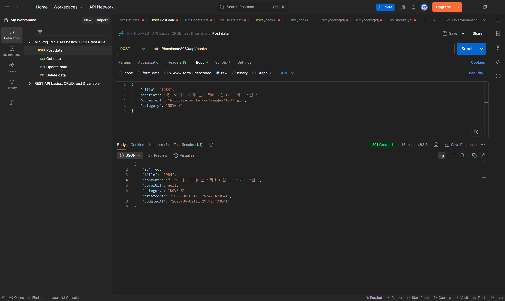
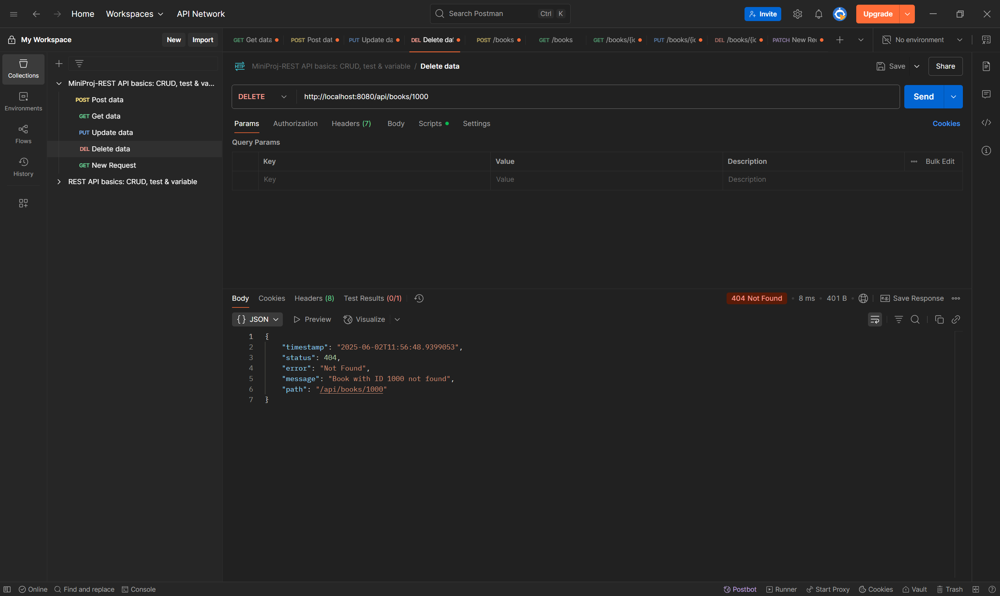

# KT-AIVLE SCHOOL 4th Mini-Proj
## 6반 17조 : 박재현 김동희 김재홍 박소현 윤용선 이유진 이은수 정유라
도서관리시스템 개발
(AI를 활용한 도서표지 이미지 생성)
Spring Boot와 React를 활용한 풀스택 웹 애플리케이션 개발 역량 강화,
REST API 설계 및 구현, JPA를 이용한 데이터베이스 연동, 외부 API(OpenAI) 연동


# How to run
## FrontEnd
```bash
cd Frontend
npm install
npm run dev
```
## BackEnd
```
Backend 폴더 이동
build.gradle 실행
LibraryManagementApplication.java 실행
```
### Book 엔티티 클래스 정의
```java
package com.aivle_17.library_management.domain;

import lombok.*;
import org.hibernate.annotations.CreationTimestamp;
import org.hibernate.annotations.UpdateTimestamp;

import jakarta.persistence.*;
import jakarta.validation.constraints.NotNull;
import jakarta.validation.constraints.Size;
import java.time.LocalDateTime;

@Entity
@Getter
@NoArgsConstructor(access = AccessLevel.PROTECTED)
@AllArgsConstructor
@Builder
public class Book {

    @Id
    @GeneratedValue(strategy = GenerationType.IDENTITY)
    private Long id;

    @NotNull(message = "Title cannot be null")
    @Size(max = 255, message = "Title cannot exceed 255 characters")
    private String title;

    @Column(columnDefinition = "TEXT")
    private String content;

    @Size(max = 2048, message = "Cover URL cannot exceed 2048 characters")
    private String coverUrl;

    @NotNull(message = "Category cannot be null")
    @Enumerated(EnumType.STRING)
    private CategoryEnum category;

    @CreationTimestamp
    @Column(updatable = false)
    private LocalDateTime createdAt;

    @UpdateTimestamp
    private LocalDateTime updatedAt;

    public void update(String title, String content, String coverUrl, CategoryEnum category) {
        this.title = title;
        this.content = content;
        this.coverUrl = coverUrl;
        this.category = category;
    }

    public void partialUpdate(String title, String content, String coverUrl, CategoryEnum category) {
        if (title != null) {
            this.title = title;
        }
        if (content != null) {
            this.content = content;
        }
        if (coverUrl != null) {
            this.coverUrl = coverUrl;
        }
        if (category != null) {
            this.category = category;
        }
    }
}
```
### BookRepository 인터페이스 정의 (Spring Data JPA)
```java
package com.aivle_17.library_management.repository;

import com.aivle_17.library_management.domain.Book;
import com.aivle_17.library_management.domain.CategoryEnum;
import org.springframework.data.domain.Page;
import org.springframework.data.domain.Pageable;
import org.springframework.data.jpa.repository.JpaRepository;
import org.springframework.stereotype.Repository;

@Repository
public interface BookRepository extends JpaRepository<Book, Long> {
    Page<Book> findByTitleContainingIgnoreCase(String title, Pageable pageable);
    Page<Book> findByCategory(CategoryEnum category, Pageable pageable);
    Page<Book> findByTitleContainingIgnoreCaseAndCategory(String title, CategoryEnum category, Pageable pageable);
}
```
### BookService 인터페이스 및 BookServiceImpl 구현 클래스
- BookService 인터페이스
```java
package com.aivle_17.library_management.service;

import com.aivle_17.library_management.domain.Book;
import com.aivle_17.library_management.domain.CategoryEnum;
import com.aivle_17.library_management.dto.BookCreateRequest;
import com.aivle_17.library_management.dto.BookPartialUpdateRequest;
import com.aivle_17.library_management.dto.BookUpdateRequest;
import org.springframework.data.domain.Page;
import org.springframework.data.domain.Pageable;

public interface BookService {
    Book createBook(BookCreateRequest request);

    Page<Book> getAllBooks(String title, CategoryEnum category, Pageable pageable);

    Book getBookById(Long bookId);

    Book updateBook(Long id, BookUpdateRequest request);

    Book partialUpdateBook(Long id, BookPartialUpdateRequest request);

    void deleteBook(Long bookId);
}

```
- BookServiceImpl 클래스
```
package com.aivle_17.library_management.service;

import com.aivle_17.library_management.domain.Book;
import com.aivle_17.library_management.domain.CategoryEnum;
import com.aivle_17.library_management.dto.BookCreateRequest;
import com.aivle_17.library_management.dto.BookPartialUpdateRequest;
import com.aivle_17.library_management.dto.BookUpdateRequest;
import com.aivle_17.library_management.exception.BookNotFoundException;
import com.aivle_17.library_management.repository.BookRepository;
import lombok.RequiredArgsConstructor;
import org.springframework.data.domain.Page;
import org.springframework.data.domain.Pageable;
import org.springframework.stereotype.Service;
import org.springframework.transaction.annotation.Transactional;

@Service
@RequiredArgsConstructor
@Transactional(readOnly = true)
public class BookServiceImpl implements BookService {

    private final BookRepository bookRepository;

    @Override
    @Transactional
    public Book createBook(BookCreateRequest request) {
        Book book = Book.builder()
                .title(request.getTitle())
                .content(request.getContent())
                .coverUrl(request.getCoverUrl())
                .category(request.getCategory())
                .build();
        return bookRepository.save(book);
    }

    @Override
    public Page<Book> getAllBooks(String title, CategoryEnum category, Pageable pageable) {
        if (title != null && category != null) {
            return bookRepository.findByTitleContainingIgnoreCaseAndCategory(title, category, pageable);
        } else if (title != null) {
            return bookRepository.findByTitleContainingIgnoreCase(title, pageable);
        } else if (category != null) {
            return bookRepository.findByCategory(category, pageable);
        } else {
            return bookRepository.findAll(pageable);
        }
    }

    @Override
    public Book getBookById(Long id) {
        return bookRepository.findById(id)
                .orElseThrow(() -> new BookNotFoundException("Book with ID " + id + " not found"));
    }

    @Override
    @Transactional
    public Book updateBook(Long id, BookUpdateRequest request) {
        Book book = bookRepository.findById(id)
                .orElseThrow(() -> new BookNotFoundException("Book with ID " + id + " not found"));
        book.update(request.getTitle(), request.getContent(), request.getCoverUrl(), request.getCategory());
        return book;
    }

    @Override
    @Transactional
    public Book partialUpdateBook(Long id, BookPartialUpdateRequest request) {
        Book book = bookRepository.findById(id)
                .orElseThrow(() -> new BookNotFoundException("Book with ID " + id + " not found"));
        book.partialUpdate(request.getTitle(), request.getContent(), request.getCoverUrl(), request.getCategory());
        return book;
    }

    @Override
    @Transactional
    public void deleteBook(Long id) {
        if (!bookRepository.existsById(id)) {
            throw new BookNotFoundException("Book with ID " + id + " not found");
        }
        bookRepository.deleteById(id);
    }
}
```
### BookController
```java
package com.aivle_17.library_management.controller;

import com.aivle_17.library_management.domain.Book;
import com.aivle_17.library_management.domain.CategoryEnum;
import com.aivle_17.library_management.dto.BookCreateRequest;
import com.aivle_17.library_management.dto.BookPartialUpdateRequest;
import com.aivle_17.library_management.dto.BookResponse;
import com.aivle_17.library_management.dto.BookUpdateRequest;
import com.aivle_17.library_management.service.BookServiceImpl;
import jakarta.validation.Valid;
import lombok.RequiredArgsConstructor;
import org.springframework.data.domain.Page;
import org.springframework.data.domain.PageRequest;
import org.springframework.data.domain.Pageable;
import org.springframework.data.domain.Sort;
import org.springframework.http.HttpStatus;
import org.springframework.http.ResponseEntity;
import org.springframework.web.bind.annotation.*;

@RestController
@RequestMapping("/api/books")
@RequiredArgsConstructor
public class BookController {

    private final BookServiceImpl bookServiceImpl;

    @PostMapping
    public ResponseEntity<BookResponse> createBook(@Valid @RequestBody BookCreateRequest request) {
        Book book = bookServiceImpl.createBook(request);
        return new ResponseEntity<>(BookResponse.from(book), HttpStatus.CREATED);
    }

    @GetMapping
    public ResponseEntity<Page<BookResponse>> getAllBooks(
            @RequestParam(defaultValue = "0") int page,
            @RequestParam(defaultValue = "10") int size,
            @RequestParam(defaultValue = "createdAt") String sortBy,
            @RequestParam(defaultValue = "asc") String direction,
            @RequestParam(required = false) String title,
            @RequestParam(required = false) CategoryEnum category
    ) {
        Sort sort = Sort.by(Sort.Direction.fromString(direction), sortBy);
        Pageable pageable = PageRequest.of(page, size, sort);
        Page<BookResponse> bookPage = bookServiceImpl.getAllBooks(title, category, pageable)
                .map(BookResponse::from);
        return ResponseEntity.ok(bookPage);
    }

    @GetMapping("/{id}")
    public ResponseEntity<BookResponse> getBookById(@PathVariable Long id) {
        Book book = bookServiceImpl.getBookById(id);
        return ResponseEntity.ok(BookResponse.from(book));
    }

    @PutMapping("/{id}")
    public ResponseEntity<BookResponse> updateBook(@PathVariable Long id, @Valid @RequestBody BookUpdateRequest request) {
        Book updatedBook = bookServiceImpl.updateBook(id, request);
        return ResponseEntity.ok(BookResponse.from(updatedBook));
    }

    @PatchMapping("/{id}")
    public ResponseEntity<BookResponse> partialUpdateBook(@PathVariable Long id, @RequestBody BookPartialUpdateRequest request) {
        Book updatedBook = bookServiceImpl.partialUpdateBook(id, request);
        return ResponseEntity.ok(BookResponse.from(updatedBook));
    }

    @DeleteMapping("/{id}")
    public ResponseEntity<Void> deleteBook(@PathVariable Long id) {
        bookServiceImpl.deleteBook(id);
        return ResponseEntity.noContent().build();
    }
}
```
### DTO (Data Transfer Object) 정의
- BookCreateRequest
```java
package com.aivle_17.library_management.dto;

import com.aivle_17.library_management.domain.CategoryEnum;
import jakarta.validation.constraints.NotNull;
import jakarta.validation.constraints.Size;
import lombok.Getter;
import lombok.Setter;

@Getter
@Setter
public class BookCreateRequest {
    @NotNull(message = "Title is required")
    @Size(max = 255, message = "Title cannot exceed 255 characters")
    private String title;
    private String content;
    @Size(max = 2048, message = "Cover URL cannot exceed 2048 characters")
    private String coverUrl;
    @NotNull(message = "Category is required")
    private CategoryEnum category;
}
```
- BookPartialUpdateRequest
```java
package com.aivle_17.library_management.dto;

import com.aivle_17.library_management.domain.CategoryEnum;
import jakarta.validation.constraints.Size;
import lombok.Getter;
import lombok.Setter;

@Getter
@Setter
public class BookPartialUpdateRequest {
    @Size(max = 255, message = "Title cannot exceed 255 characters")
    private String title;
    private String content;
    @Size(max = 2048, message = "Cover URL cannot exceed 2048 characters")
    private String coverUrl;
    private CategoryEnum category;
}
```
- BookResponse
```java
package com.aivle_17.library_management.dto;

import com.aivle_17.library_management.domain.Book;
import com.aivle_17.library_management.domain.CategoryEnum;
import lombok.Builder;
import lombok.Getter;

import java.time.LocalDateTime;

@Getter
@Builder
public class BookResponse {
    private Long id;
    private String title;
    private String content;
    private String coverUrl;
    private CategoryEnum category;
    private LocalDateTime createdAt;
    private LocalDateTime updatedAt;

    public static BookResponse from(Book book) {
        return BookResponse.builder()
                .id(book.getId())
                .title(book.getTitle())
                .content(book.getContent())
                .coverUrl(book.getCoverUrl())
                .category(book.getCategory())
                .createdAt(book.getCreatedAt())
                .updatedAt(book.getUpdatedAt())
                .build();
    }
}
```
- BookUpdateRequest
```java
package com.aivle_17.library_management.dto;

import com.aivle_17.library_management.domain.CategoryEnum;
import jakarta.validation.constraints.NotNull;
import jakarta.validation.constraints.Size;
import lombok.Getter;
import lombok.Setter;

@Getter
@Setter
public class BookUpdateRequest {
    @NotNull(message = "Title is required")
    @Size(max = 255, message = "Title cannot exceed 255 characters")
    private String title;
    private String content;
    @Size(max = 2048, message = "Cover URL cannot exceed 2048 characters")
    private String coverUrl;
    @NotNull(message = "Category is required")
    private CategoryEnum category;
}
```
### 예외 처리기 구현
- BookNotFoundException (런타임 오류)
```java
package com.aivle_17.library_management.exception;

import org.springframework.http.HttpStatus;
import org.springframework.web.bind.annotation.ResponseStatus;

@ResponseStatus(HttpStatus.NOT_FOUND)
public class BookNotFoundException extends RuntimeException {
    public BookNotFoundException(String message) {
        super(message);
    }
}
```
- GlobalExceptionHandler
```java
package com.aivle_17.library_management.exception;

import lombok.AllArgsConstructor;
import lombok.Getter;
import org.springframework.http.HttpStatus;
import org.springframework.http.ResponseEntity;
import org.springframework.web.bind.MethodArgumentNotValidException;
import org.springframework.web.bind.annotation.ControllerAdvice;
import org.springframework.web.bind.annotation.ExceptionHandler;
import org.springframework.web.context.request.WebRequest;

import java.time.LocalDateTime;
import java.util.HashMap;
import java.util.Map;

@ControllerAdvice
public class GlobalExceptionHandler {

    @ExceptionHandler(BookNotFoundException.class)
    public ResponseEntity<ErrorResponse> handleBookNotFoundException(BookNotFoundException ex, WebRequest request) {
        ErrorResponse errorResponse = new ErrorResponse(
                LocalDateTime.now(),
                HttpStatus.NOT_FOUND.value(),
                HttpStatus.NOT_FOUND.getReasonPhrase(),
                ex.getMessage(),
                request.getDescription(false).replace("uri=", "")
        );
        return new ResponseEntity<>(errorResponse, HttpStatus.NOT_FOUND);
    }

    @ExceptionHandler(MethodArgumentNotValidException.class)
    public ResponseEntity<ErrorResponse> handleValidationExceptions(MethodArgumentNotValidException ex, WebRequest request) {
        Map<String, String> errors = new HashMap<>();
        ex.getBindingResult().getFieldErrors().forEach(error ->
                errors.put(error.getField(), error.getDefaultMessage()));

        StringBuilder messageBuilder = new StringBuilder("Validation failed: ");
        errors.forEach((field, msg) -> messageBuilder.append(field).append(" ").append(msg).append("; "));
        String message = messageBuilder.toString().trim();
        if (message.endsWith(";")) {
            message = message.substring(0, message.length() - 1);
        }

        ErrorResponse errorResponse = new ErrorResponse(
                LocalDateTime.now(),
                HttpStatus.BAD_REQUEST.value(),
                HttpStatus.BAD_REQUEST.getReasonPhrase(),
                message,
                request.getDescription(false).replace("uri=", "")
        );
        return new ResponseEntity<>(errorResponse, HttpStatus.BAD_REQUEST);
    }

    @ExceptionHandler(IllegalArgumentException.class)
    public ResponseEntity<ErrorResponse> handleIllegalArgumentException(IllegalArgumentException ex, WebRequest request) {
        ErrorResponse errorResponse = new ErrorResponse(
                LocalDateTime.now(),
                HttpStatus.BAD_REQUEST.value(),
                HttpStatus.BAD_REQUEST.getReasonPhrase(),
                ex.getMessage(),
                request.getDescription(false).replace("uri=", "")
        );
        return new ResponseEntity<>(errorResponse, HttpStatus.BAD_REQUEST);
    }


    @ExceptionHandler(Exception.class)
    public ResponseEntity<ErrorResponse> handleGlobalException(Exception ex, WebRequest request) {
        ErrorResponse errorResponse = new ErrorResponse(
                LocalDateTime.now(),
                HttpStatus.INTERNAL_SERVER_ERROR.value(),
                HttpStatus.INTERNAL_SERVER_ERROR.getReasonPhrase(),
                "An unexpected error occurred: " + ex.getMessage(),
                request.getDescription(false).replace("uri=", "")
        );
        return new ResponseEntity<>(errorResponse, HttpStatus.INTERNAL_SERVER_ERROR);
    }

    @Getter
    @AllArgsConstructor
    private static class ErrorResponse {
        private LocalDateTime timestamp;
        private int status;
        private String error;
        private String message;
        private String path;
    }
}
```
### CORS 설정
```java
package com.aivle_17.library_management.config;

import org.springframework.context.annotation.Configuration;
import org.springframework.web.servlet.config.annotation.CorsRegistry;
import org.springframework.web.servlet.config.annotation.WebMvcConfigurer;

@Configuration // Spring 설정 클래스임을 나타냅니다.
public class CorsConfig implements WebMvcConfigurer {

    @Override
    public void addCorsMappings(CorsRegistry registry) {
        registry.addMapping("/api/**") // 1. CORS를 적용할 API 경로 패턴을 지정합니다. (예: /api/books, /api/users 등 모든 /api/** 경로)
                .allowedOrigins("http://localhost:5173", "http://127.0.0.1:5173") // 2. CORS를 허용할 특정 출처(Origin)를 명시합니다. 프론트엔드 URL을 여기에 입력합니다.
                // .allowedOrigins("*") // 2-Alternative: 모든 출처를 허용하려면 "*"을 사용합니다. (개발 시 편리하나, 실제 운영 환경에서는 보안상 특정 출처만 허용하는 것이 좋습니다.)
                .allowedMethods("GET", "POST", "PUT", "PATCH", "DELETE", "OPTIONS") // 3. 허용할 HTTP 메서드를 지정합니다. OPTIONS는 Preflight 요청을 위해 필요합니다.
                .allowedHeaders("*") // 4. 모든 헤더를 허용합니다. (예: Content-Type, Authorization 등)
                .allowCredentials(true) // 5. 자격 증명(쿠키, HTTP 인증, SSL 클라이언트 인증서)을 요청에 포함할지 여부를 지정합니다.
                .maxAge(3600); // 6. Preflight 요청의 결과를 캐시할 시간(초)을 지정합니다. (하루)
    }
}
```
### Postman API 단위 테스트
#### 도서 생성 POST - 201 Created

#### 도서 생성 POST - 400 Bad Request

#### 도서 목록 조회 Get - 200 OK
- 쿼리 파라미터를 집어 넣을 수 있으나 이하 생략

#### 단일 도서 조회 Get - 200 OK

#### 단일 도서 조회 Get - 404 Not Found

#### 책 업데이트 PUT - 200 OK

#### 책 업데이트 PUT - 404 NOt Found

#### 책 업데이트 PUT - 400 Bad Request

#### 책 업데이트 PATCH - 200 OK

#### 책 업데이트 PATCH - 404 Not Found

#### 책 삭제 DELETE - 204 No Content

#### 책 삭제 DELETE - 404 Not Found

#### 책 삭제 DELETE - 409 Conflict
- 시스템이 복잡한 경우 충돌이 날 수도 있다.
  
### frontend 메인(HomePage.jsx)정의


## Skills
- 백엔드 : Java, Spring Boot, Spring MVC (REST API), Spring Data JPA, Lombok
- 프론트엔드 : JavaScript (ES6+), React, Axios, React Router, Material-UI (MUI)
- 데이터베이스 : H2 (개발용)
- API : RESTful API, OpenAI API (DALL·E)
