# KT-AIVLE SCHOOL 4th Mini-Proj
## 6반 17조 : 박재현 김동희 김재홍 박소현 윤용선 이유진 이은수 정유라
도서관리시스템 개발
(AI를 활용한 도서표지 이미지 생성)
Spring Boot와 React를 활용한 풀스택 웹 애플리케이션 개발 역량 강화,
REST API 설계 및 구현, JPA를 이용한 데이터베이스 연동, 외부 API(OpenAI) 연동

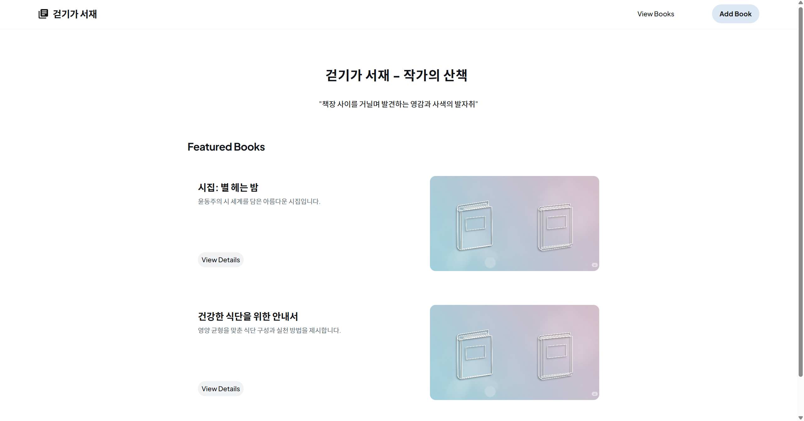
# How to run
## FrontEnd
```bash
cd Frontend
npm install
npm run dev
```
## BackEnd
```
Backend 폴더 이동
build.gradle 실행
LibraryManagementApplication.java 실행
```
### Book 엔티티 클래스 정의
```java
package com.aivle_17.library_management.domain;

import lombok.*;
import org.hibernate.annotations.CreationTimestamp;
import org.hibernate.annotations.UpdateTimestamp;

import jakarta.persistence.*;
import jakarta.validation.constraints.NotNull;
import jakarta.validation.constraints.Size;
import java.time.LocalDateTime;

@Entity
@Getter
@NoArgsConstructor(access = AccessLevel.PROTECTED)
@AllArgsConstructor
@Builder
public class Book {

    @Id
    @GeneratedValue(strategy = GenerationType.IDENTITY)
    private Long id;

    @NotNull(message = "Title cannot be null")
    @Size(max = 255, message = "Title cannot exceed 255 characters")
    private String title;

    @Column(columnDefinition = "TEXT")
    private String content;

    @Size(max = 2048, message = "Cover URL cannot exceed 2048 characters")
    private String coverUrl;

    @NotNull(message = "Category cannot be null")
    @Enumerated(EnumType.STRING)
    private CategoryEnum category;

    @CreationTimestamp
    @Column(updatable = false)
    private LocalDateTime createdAt;

    @UpdateTimestamp
    private LocalDateTime updatedAt;

    public void update(String title, String content, String coverUrl, CategoryEnum category) {
        this.title = title;
        this.content = content;
        this.coverUrl = coverUrl;
        this.category = category;
    }

    public void partialUpdate(String title, String content, String coverUrl, CategoryEnum category) {
        if (title != null) {
            this.title = title;
        }
        if (content != null) {
            this.content = content;
        }
        if (coverUrl != null) {
            this.coverUrl = coverUrl;
        }
        if (category != null) {
            this.category = category;
        }
    }
}
```
### BookRepository 인터페이스 정의 (Spring Data JPA)
```java
package com.aivle_17.library_management.repository;

import com.aivle_17.library_management.domain.Book;
import com.aivle_17.library_management.domain.CategoryEnum;
import org.springframework.data.domain.Page;
import org.springframework.data.domain.Pageable;
import org.springframework.data.jpa.repository.JpaRepository;
import org.springframework.stereotype.Repository;

@Repository
public interface BookRepository extends JpaRepository<Book, Long> {
    Page<Book> findByTitleContainingIgnoreCase(String title, Pageable pageable);
    Page<Book> findByCategory(CategoryEnum category, Pageable pageable);
    Page<Book> findByTitleContainingIgnoreCaseAndCategory(String title, CategoryEnum category, Pageable pageable);
}
```
### BookService 인터페이스 및 BookServiceImpl 구현 클래스
- BookService 인터페이스
```java
package com.aivle_17.library_management.service;

import com.aivle_17.library_management.domain.Book;
import com.aivle_17.library_management.domain.CategoryEnum;
import com.aivle_17.library_management.dto.BookCreateRequest;
import com.aivle_17.library_management.dto.BookPartialUpdateRequest;
import com.aivle_17.library_management.dto.BookUpdateRequest;
import org.springframework.data.domain.Page;
import org.springframework.data.domain.Pageable;

public interface BookService {
    Book createBook(BookCreateRequest request);

    Page<Book> getAllBooks(String title, CategoryEnum category, Pageable pageable);

    Book getBookById(Long bookId);

    Book updateBook(Long id, BookUpdateRequest request);

    Book partialUpdateBook(Long id, BookPartialUpdateRequest request);

    void deleteBook(Long bookId);
}

```
- BookServiceImpl 클래스
```
package com.aivle_17.library_management.service;

import com.aivle_17.library_management.domain.Book;
import com.aivle_17.library_management.domain.CategoryEnum;
import com.aivle_17.library_management.dto.BookCreateRequest;
import com.aivle_17.library_management.dto.BookPartialUpdateRequest;
import com.aivle_17.library_management.dto.BookUpdateRequest;
import com.aivle_17.library_management.exception.BookNotFoundException;
import com.aivle_17.library_management.repository.BookRepository;
import lombok.RequiredArgsConstructor;
import org.springframework.data.domain.Page;
import org.springframework.data.domain.Pageable;
import org.springframework.stereotype.Service;
import org.springframework.transaction.annotation.Transactional;

@Service
@RequiredArgsConstructor
@Transactional(readOnly = true)
public class BookServiceImpl implements BookService {

    private final BookRepository bookRepository;

    @Override
    @Transactional
    public Book createBook(BookCreateRequest request) {
        Book book = Book.builder()
                .title(request.getTitle())
                .content(request.getContent())
                .coverUrl(request.getCoverUrl())
                .category(request.getCategory())
                .build();
        return bookRepository.save(book);
    }

    @Override
    public Page<Book> getAllBooks(String title, CategoryEnum category, Pageable pageable) {
        if (title != null && category != null) {
            return bookRepository.findByTitleContainingIgnoreCaseAndCategory(title, category, pageable);
        } else if (title != null) {
            return bookRepository.findByTitleContainingIgnoreCase(title, pageable);
        } else if (category != null) {
            return bookRepository.findByCategory(category, pageable);
        } else {
            return bookRepository.findAll(pageable);
        }
    }

    @Override
    public Book getBookById(Long id) {
        return bookRepository.findById(id)
                .orElseThrow(() -> new BookNotFoundException("Book with ID " + id + " not found"));
    }

    @Override
    @Transactional
    public Book updateBook(Long id, BookUpdateRequest request) {
        Book book = bookRepository.findById(id)
                .orElseThrow(() -> new BookNotFoundException("Book with ID " + id + " not found"));
        book.update(request.getTitle(), request.getContent(), request.getCoverUrl(), request.getCategory());
        return book;
    }

    @Override
    @Transactional
    public Book partialUpdateBook(Long id, BookPartialUpdateRequest request) {
        Book book = bookRepository.findById(id)
                .orElseThrow(() -> new BookNotFoundException("Book with ID " + id + " not found"));
        book.partialUpdate(request.getTitle(), request.getContent(), request.getCoverUrl(), request.getCategory());
        return book;
    }

    @Override
    @Transactional
    public void deleteBook(Long id) {
        if (!bookRepository.existsById(id)) {
            throw new BookNotFoundException("Book with ID " + id + " not found");
        }
        bookRepository.deleteById(id);
    }
}
```
### BookController
```java
package com.aivle_17.library_management.controller;

import com.aivle_17.library_management.domain.Book;
import com.aivle_17.library_management.domain.CategoryEnum;
import com.aivle_17.library_management.dto.BookCreateRequest;
import com.aivle_17.library_management.dto.BookPartialUpdateRequest;
import com.aivle_17.library_management.dto.BookResponse;
import com.aivle_17.library_management.dto.BookUpdateRequest;
import com.aivle_17.library_management.service.BookServiceImpl;
import jakarta.validation.Valid;
import lombok.RequiredArgsConstructor;
import org.springframework.data.domain.Page;
import org.springframework.data.domain.PageRequest;
import org.springframework.data.domain.Pageable;
import org.springframework.data.domain.Sort;
import org.springframework.http.HttpStatus;
import org.springframework.http.ResponseEntity;
import org.springframework.web.bind.annotation.*;

@RestController
@RequestMapping("/api/books")
@RequiredArgsConstructor
public class BookController {

    private final BookServiceImpl bookServiceImpl;

    @PostMapping
    public ResponseEntity<BookResponse> createBook(@Valid @RequestBody BookCreateRequest request) {
        Book book = bookServiceImpl.createBook(request);
        return new ResponseEntity<>(BookResponse.from(book), HttpStatus.CREATED);
    }

    @GetMapping
    public ResponseEntity<Page<BookResponse>> getAllBooks(
            @RequestParam(defaultValue = "0") int page,
            @RequestParam(defaultValue = "10") int size,
            @RequestParam(defaultValue = "createdAt") String sortBy,
            @RequestParam(defaultValue = "asc") String direction,
            @RequestParam(required = false) String title,
            @RequestParam(required = false) CategoryEnum category
    ) {
        Sort sort = Sort.by(Sort.Direction.fromString(direction), sortBy);
        Pageable pageable = PageRequest.of(page, size, sort);
        Page<BookResponse> bookPage = bookServiceImpl.getAllBooks(title, category, pageable)
                .map(BookResponse::from);
        return ResponseEntity.ok(bookPage);
    }

    @GetMapping("/{id}")
    public ResponseEntity<BookResponse> getBookById(@PathVariable Long id) {
        Book book = bookServiceImpl.getBookById(id);
        return ResponseEntity.ok(BookResponse.from(book));
    }

    @PutMapping("/{id}")
    public ResponseEntity<BookResponse> updateBook(@PathVariable Long id, @Valid @RequestBody BookUpdateRequest request) {
        Book updatedBook = bookServiceImpl.updateBook(id, request);
        return ResponseEntity.ok(BookResponse.from(updatedBook));
    }

    @PatchMapping("/{id}")
    public ResponseEntity<BookResponse> partialUpdateBook(@PathVariable Long id, @RequestBody BookPartialUpdateRequest request) {
        Book updatedBook = bookServiceImpl.partialUpdateBook(id, request);
        return ResponseEntity.ok(BookResponse.from(updatedBook));
    }

    @DeleteMapping("/{id}")
    public ResponseEntity<Void> deleteBook(@PathVariable Long id) {
        bookServiceImpl.deleteBook(id);
        return ResponseEntity.noContent().build();
    }
}
```
### DTO (Data Transfer Object) 정의
- BookCreateRequest
```java
package com.aivle_17.library_management.dto;

import com.aivle_17.library_management.domain.CategoryEnum;
import jakarta.validation.constraints.NotNull;
import jakarta.validation.constraints.Size;
import lombok.Getter;
import lombok.Setter;

@Getter
@Setter
public class BookCreateRequest {
    @NotNull(message = "Title is required")
    @Size(max = 255, message = "Title cannot exceed 255 characters")
    private String title;
    private String content;
    @Size(max = 2048, message = "Cover URL cannot exceed 2048 characters")
    private String coverUrl;
    @NotNull(message = "Category is required")
    private CategoryEnum category;
}
```
- BookPartialUpdateRequest
```java
package com.aivle_17.library_management.dto;

import com.aivle_17.library_management.domain.CategoryEnum;
import jakarta.validation.constraints.Size;
import lombok.Getter;
import lombok.Setter;

@Getter
@Setter
public class BookPartialUpdateRequest {
    @Size(max = 255, message = "Title cannot exceed 255 characters")
    private String title;
    private String content;
    @Size(max = 2048, message = "Cover URL cannot exceed 2048 characters")
    private String coverUrl;
    private CategoryEnum category;
}
```
- BookResponse
```java
package com.aivle_17.library_management.dto;

import com.aivle_17.library_management.domain.Book;
import com.aivle_17.library_management.domain.CategoryEnum;
import lombok.Builder;
import lombok.Getter;

import java.time.LocalDateTime;

@Getter
@Builder
public class BookResponse {
    private Long id;
    private String title;
    private String content;
    private String coverUrl;
    private CategoryEnum category;
    private LocalDateTime createdAt;
    private LocalDateTime updatedAt;

    public static BookResponse from(Book book) {
        return BookResponse.builder()
                .id(book.getId())
                .title(book.getTitle())
                .content(book.getContent())
                .coverUrl(book.getCoverUrl())
                .category(book.getCategory())
                .createdAt(book.getCreatedAt())
                .updatedAt(book.getUpdatedAt())
                .build();
    }
}
```
- BookUpdateRequest
```java
package com.aivle_17.library_management.dto;

import com.aivle_17.library_management.domain.CategoryEnum;
import jakarta.validation.constraints.NotNull;
import jakarta.validation.constraints.Size;
import lombok.Getter;
import lombok.Setter;

@Getter
@Setter
public class BookUpdateRequest {
    @NotNull(message = "Title is required")
    @Size(max = 255, message = "Title cannot exceed 255 characters")
    private String title;
    private String content;
    @Size(max = 2048, message = "Cover URL cannot exceed 2048 characters")
    private String coverUrl;
    @NotNull(message = "Category is required")
    private CategoryEnum category;
}
```
### 예외 처리기 구현
- BookNotFoundException (런타임 오류)
```java
package com.aivle_17.library_management.exception;

import org.springframework.http.HttpStatus;
import org.springframework.web.bind.annotation.ResponseStatus;

@ResponseStatus(HttpStatus.NOT_FOUND)
public class BookNotFoundException extends RuntimeException {
    public BookNotFoundException(String message) {
        super(message);
    }
}
```
- GlobalExceptionHandler
```java
package com.aivle_17.library_management.exception;

import lombok.AllArgsConstructor;
import lombok.Getter;
import org.springframework.http.HttpStatus;
import org.springframework.http.ResponseEntity;
import org.springframework.web.bind.MethodArgumentNotValidException;
import org.springframework.web.bind.annotation.ControllerAdvice;
import org.springframework.web.bind.annotation.ExceptionHandler;
import org.springframework.web.context.request.WebRequest;

import java.time.LocalDateTime;
import java.util.HashMap;
import java.util.Map;

@ControllerAdvice
public class GlobalExceptionHandler {

    @ExceptionHandler(BookNotFoundException.class)
    public ResponseEntity<ErrorResponse> handleBookNotFoundException(BookNotFoundException ex, WebRequest request) {
        ErrorResponse errorResponse = new ErrorResponse(
                LocalDateTime.now(),
                HttpStatus.NOT_FOUND.value(),
                HttpStatus.NOT_FOUND.getReasonPhrase(),
                ex.getMessage(),
                request.getDescription(false).replace("uri=", "")
        );
        return new ResponseEntity<>(errorResponse, HttpStatus.NOT_FOUND);
    }

    @ExceptionHandler(MethodArgumentNotValidException.class)
    public ResponseEntity<ErrorResponse> handleValidationExceptions(MethodArgumentNotValidException ex, WebRequest request) {
        Map<String, String> errors = new HashMap<>();
        ex.getBindingResult().getFieldErrors().forEach(error ->
                errors.put(error.getField(), error.getDefaultMessage()));

        StringBuilder messageBuilder = new StringBuilder("Validation failed: ");
        errors.forEach((field, msg) -> messageBuilder.append(field).append(" ").append(msg).append("; "));
        String message = messageBuilder.toString().trim();
        if (message.endsWith(";")) {
            message = message.substring(0, message.length() - 1);
        }

        ErrorResponse errorResponse = new ErrorResponse(
                LocalDateTime.now(),
                HttpStatus.BAD_REQUEST.value(),
                HttpStatus.BAD_REQUEST.getReasonPhrase(),
                message,
                request.getDescription(false).replace("uri=", "")
        );
        return new ResponseEntity<>(errorResponse, HttpStatus.BAD_REQUEST);
    }

    @ExceptionHandler(IllegalArgumentException.class)
    public ResponseEntity<ErrorResponse> handleIllegalArgumentException(IllegalArgumentException ex, WebRequest request) {
        ErrorResponse errorResponse = new ErrorResponse(
                LocalDateTime.now(),
                HttpStatus.BAD_REQUEST.value(),
                HttpStatus.BAD_REQUEST.getReasonPhrase(),
                ex.getMessage(),
                request.getDescription(false).replace("uri=", "")
        );
        return new ResponseEntity<>(errorResponse, HttpStatus.BAD_REQUEST);
    }


    @ExceptionHandler(Exception.class)
    public ResponseEntity<ErrorResponse> handleGlobalException(Exception ex, WebRequest request) {
        ErrorResponse errorResponse = new ErrorResponse(
                LocalDateTime.now(),
                HttpStatus.INTERNAL_SERVER_ERROR.value(),
                HttpStatus.INTERNAL_SERVER_ERROR.getReasonPhrase(),
                "An unexpected error occurred: " + ex.getMessage(),
                request.getDescription(false).replace("uri=", "")
        );
        return new ResponseEntity<>(errorResponse, HttpStatus.INTERNAL_SERVER_ERROR);
    }

    @Getter
    @AllArgsConstructor
    private static class ErrorResponse {
        private LocalDateTime timestamp;
        private int status;
        private String error;
        private String message;
        private String path;
    }
}
```
### CORS 설정
```java
package com.aivle_17.library_management.config;

import org.springframework.context.annotation.Configuration;
import org.springframework.web.servlet.config.annotation.CorsRegistry;
import org.springframework.web.servlet.config.annotation.WebMvcConfigurer;

@Configuration // Spring 설정 클래스임을 나타냅니다.
public class CorsConfig implements WebMvcConfigurer {

    @Override
    public void addCorsMappings(CorsRegistry registry) {
        registry.addMapping("/api/**") // 1. CORS를 적용할 API 경로 패턴을 지정합니다. (예: /api/books, /api/users 등 모든 /api/** 경로)
                .allowedOrigins("http://localhost:5173", "http://127.0.0.1:5173") // 2. CORS를 허용할 특정 출처(Origin)를 명시합니다. 프론트엔드 URL을 여기에 입력합니다.
                // .allowedOrigins("*") // 2-Alternative: 모든 출처를 허용하려면 "*"을 사용합니다. (개발 시 편리하나, 실제 운영 환경에서는 보안상 특정 출처만 허용하는 것이 좋습니다.)
                .allowedMethods("GET", "POST", "PUT", "PATCH", "DELETE", "OPTIONS") // 3. 허용할 HTTP 메서드를 지정합니다. OPTIONS는 Preflight 요청을 위해 필요합니다.
                .allowedHeaders("*") // 4. 모든 헤더를 허용합니다. (예: Content-Type, Authorization 등)
                .allowCredentials(true) // 5. 자격 증명(쿠키, HTTP 인증, SSL 클라이언트 인증서)을 요청에 포함할지 여부를 지정합니다.
                .maxAge(3600); // 6. Preflight 요청의 결과를 캐시할 시간(초)을 지정합니다. (하루)
    }
}
```
### Postman API 단위 테스트
#### 도서 생성 POST - 201 Created

#### 도서 생성 POST - 400 Bad Request
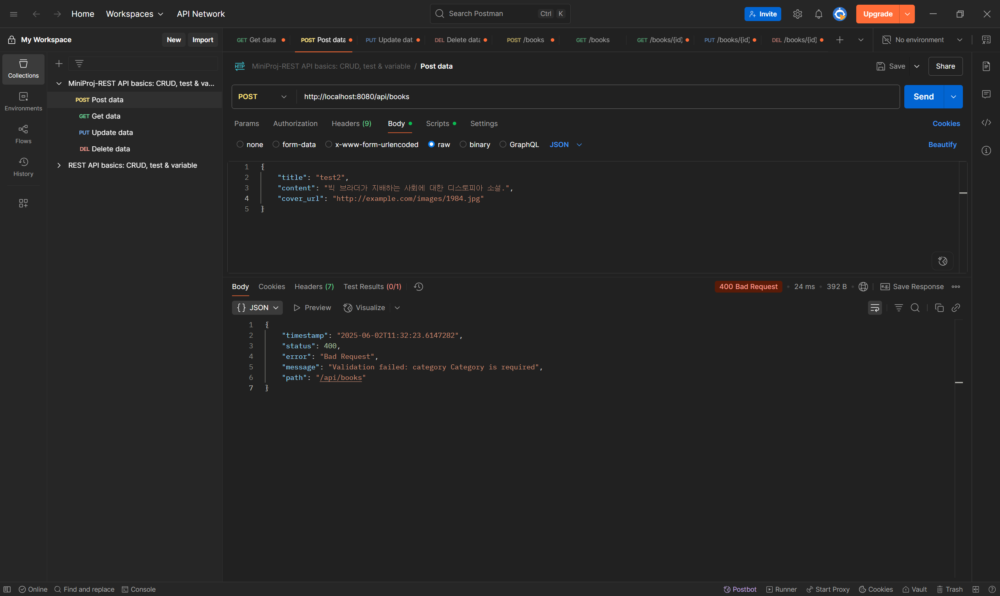
#### 도서 목록 조회 Get - 200 OK
- 쿼리 파라미터를 집어 넣을 수 있으나 이하 생략
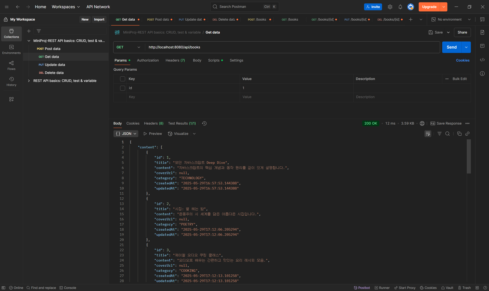
#### 단일 도서 조회 Get - 200 OK
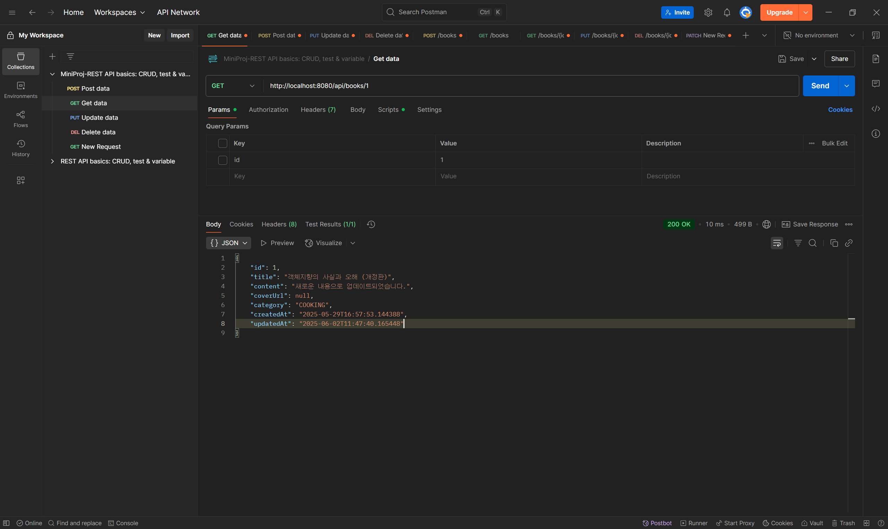
#### 단일 도서 조회 Get - 404 Not Found
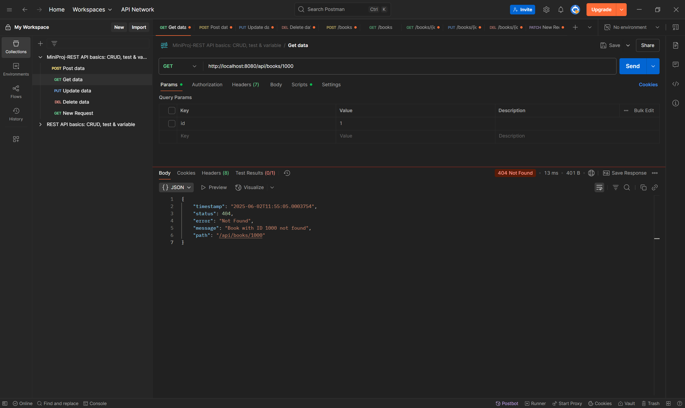
#### 책 업데이트 PUT - 200 OK
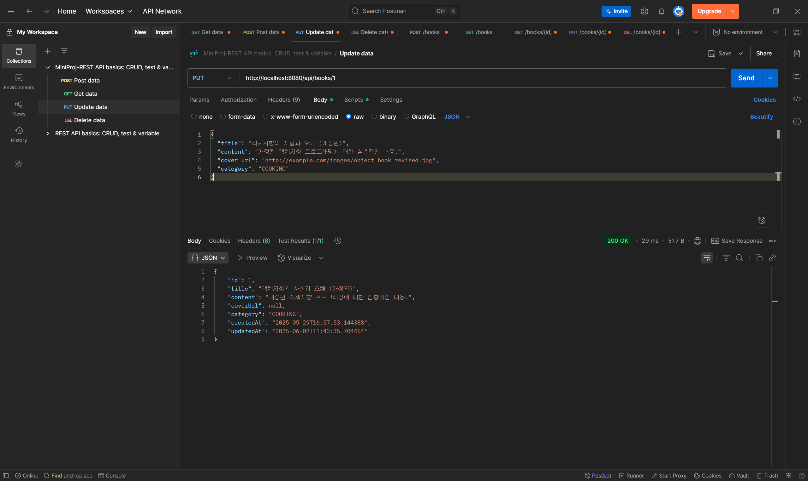
#### 책 업데이트 PUT - 404 NOt Found

#### 책 업데이트 PUT - 400 Bad Request

#### 책 업데이트 PATCH - 200 OK

#### 책 업데이트 PATCH - 404 Not Found
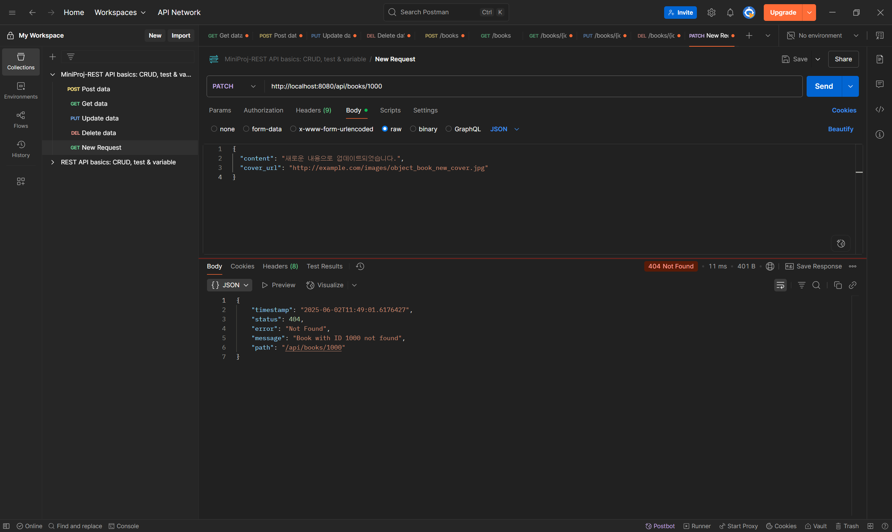
#### 책 삭제 DELETE - 204 No Content
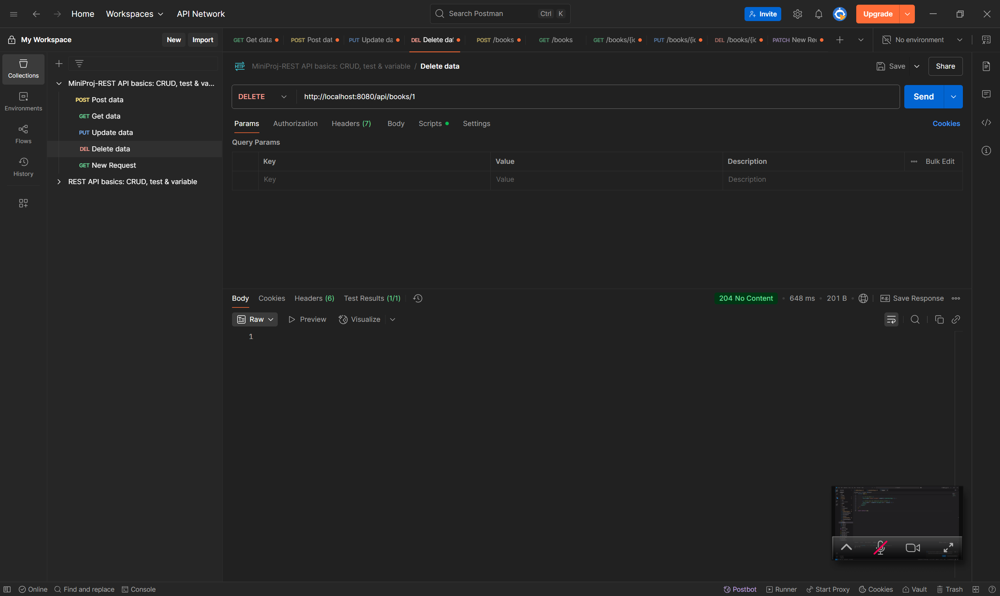
#### 책 삭제 DELETE - 404 Not Found

#### 책 삭제 DELETE - 409 Conflict
- 시스템이 복잡한 경우 충돌이 날 수도 있다.
  
### Frontend 주요 기능 및 페이지 설명

#### 1. `HomePage.jsx` (메인 페이지)
* 애플리케이션의 진입점으로, "걷기가 서재 - 작가의 산책"이라는 타이틀과 함께 주요 도서를 소개합니다.
* **주요 기능**:
    * 백엔드 API (`getAllBooks`)를 호출하여 전체 도서 목록 중 2권을 무작위로 선택하여 'Featured Books' 섹션에 표시합니다.
    * `FeaturedBookCard` 컴포넌트를 사용하여 각 추천 도서의 정보를 카드 형태로 보여줍니다.
    * 데이터 로딩 및 오류 발생 시 사용자에게 적절한 UI(로딩 스피너, 에러 메시지)를 제공합니다.
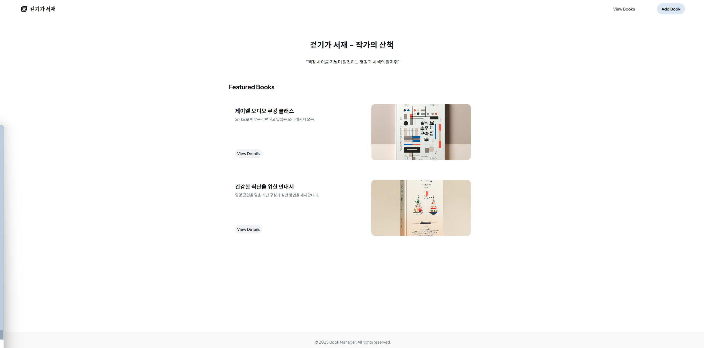

#### 2. `ViewBooksPage.jsx` (도서 목록 페이지)
* 시스템에 등록된 모든 도서의 목록을 테이블 형태로 보여주고, 사용자가 도서를 관리할 수 있는 다양한 기능을 제공합니다.
* **주요 기능**:
    * 백엔드 API (`getAllBooks`)를 통해 도서 목록을 조회합니다. `AppBar` 내 검색창을 통해 **도서 제목으로 실시간 검색**이 가능합니다.
    * 테이블에는 각 도서의 제목, 카테고리, 생성 일시가 표시됩니다.
    * 각 도서 항목마다 다음 액션을 수행할 수 있는 버튼을 제공합니다:
        * **View Details**: 해당 도서의 상세 정보 페이지(`BookDetailPage`)로 이동합니다.
        * **Edit**: 해당 도서의 수정 페이지(`UpdateBookPage`)로 이동합니다.
        * **Delete**: `DeleteBookDialog` 컴포넌트를 통해 도서 삭제를 수행합니다. (API: `deleteBook`)
    * 도서가 없을 경우 "No books found." 메시지를 표시합니다.
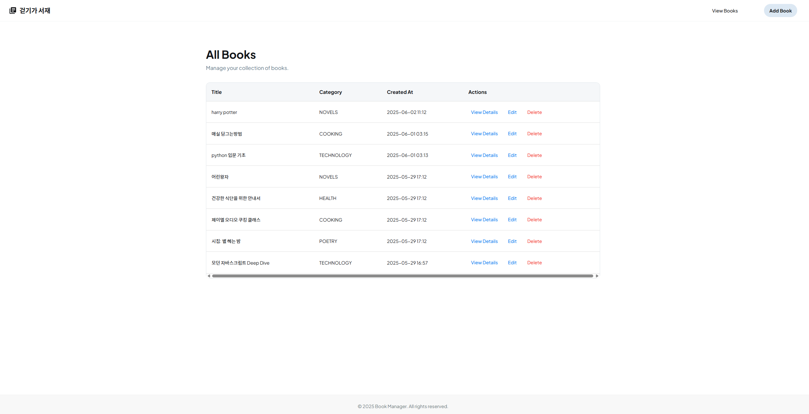

#### 3. `AddBookPage.jsx` (도서 추가 페이지)
* 새로운 도서를 시스템에 추가하기 위한 폼과 기능을 제공합니다.
* **주요 기능**:
    * 도서의 **제목**(최대 20자), **내용**(최대 500자), **카테고리**를 입력받습니다. 각 입력 필드에는 글자 수 제한 및 현재 글자 수가 표시됩니다.
    * **DALL-E 연동 표지 이미지 생성**:
        * 사용자가 OpenAI API 키와 도서 제목을 입력한 후 'Generate Image' 버튼을 클릭하면 `generateBookCoverImage` 함수가 OpenAI API를 직접 호출하여 책 표지 이미지를 생성합니다.
        * 생성된 이미지는 페이지 내에 미리보기 형태로 즉시 표시됩니다. 이미지가 없거나 생성 중일 때는 기본 이미지(`default-cover.png`) 또는 로딩 상태가 표시됩니다.
    * 필수 정보(제목, 카테고리 등)가 모두 입력되면 'Add Book' 버튼을 통해 `createBook` API를 호출하여 새 도서 정보를 백엔드 서버에 저장합니다.
    * 입력값 유효성 검사(예: 카테고리 선택 여부) 및 작업 결과(성공, 실패, 경고)를 사용자에게 Snackbar 메시지로 피드백합니다.
    * 'Cancel' 버튼을 통해 도서 추가를 취소하고 메인 페이지로 돌아갈 수 있습니다.
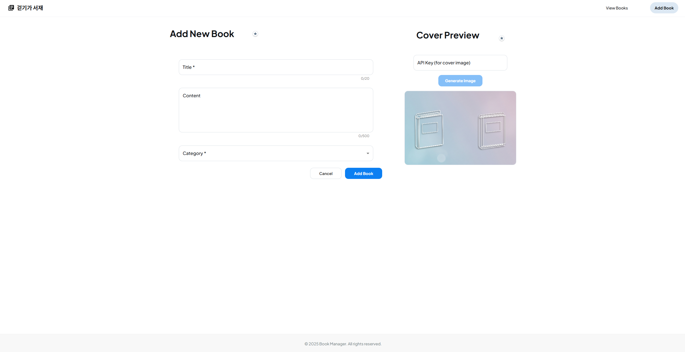

#### 4. `BookDetailPage.jsx` (도서 상세 정보 페이지)
* 특정 도서 한 권에 대한 모든 상세 정보를 보여주는 페이지입니다.
* **주요 기능**:
    * URL 경로의 파라미터(`id`)를 사용하여 `getBookById` API를 호출, 해당 ID의 도서 정보를 가져와 화면에 표시합니다.
    * 도서의 제목, 전체 내용, 카테고리, 그리고 표지 이미지를 상세하게 보여줍니다.
    * 표지 이미지가 없거나 URL 로딩에 실패한 경우, `onError` 핸들러를 통해 기본 이미지(`default-cover.png`)로 대체 표시됩니다.
    * 페이지 상단에는 "Books / {책 제목}" 형태의 **Breadcrumbs**를 제공하여 사용자의 현재 위치와 네비게이션 경로를 명확히 안내합니다.
    * **Edit** 버튼: 해당 도서의 정보를 수정할 수 있는 `UpdateBookPage`로 이동합니다.
    * **Delete** 버튼: `DeleteBookDialog`를 열어 해당 도서를 삭제할 수 있도록 합니다.
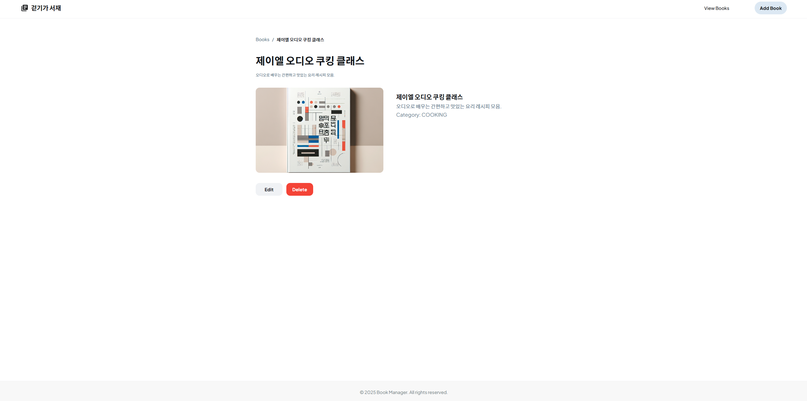

#### 5. `UpdateBookPage.jsx` (도서 수정 페이지)
* 기존에 등록된 도서의 정보를 수정하는 기능을 제공합니다.
* **주요 기능**:
    * URL 경로의 파라미터(`id`)를 사용하여 `getBookById` API를 호출, 해당 도서의 현재 정보를 가져와 폼에 미리 채워줍니다. (`initialFormData` 상태에 원본 데이터 저장)
    * 도서의 제목(최대 20자), 내용(최대 500자), 카테고리, 표지 이미지를 수정할 수 있습니다. 입력 필드 UI는 `AddBookPage`와 유사합니다.
    * **DALL-E 연동 표지 이미지 재생성**: `AddBookPage`와 동일하게, API 키와 (변경된) 제목을 이용하여 새로운 표지 이미지를 생성하고 기존 이미지를 대체할 수 있습니다.
    * **변경 감지 로직**: 사용자가 폼 데이터를 수정한 경우에만 'Update Book' 버튼이 활성화됩니다. (`hasFormChanged` 함수와 `shallowEqual` 유틸리티 사용) 변경 사항이 없으면 버튼은 비활성화되고, 제출 시 "변경된 내용이 없습니다."라는 Snackbar 메시지가 표시됩니다.
    * 'Update Book' 버튼 클릭 시 `partialUpdateBook` API를 사용하여 변경된 필드만 백엔드 서버로 전송하여 도서 정보를 업데이트합니다.
    * 입력값 유효성 검사 및 작업 결과를 Snackbar 메시지로 피드백합니다.
    * 'Cancel' 버튼을 통해 수정을 취소하고 이전 페이지(일반적으로 해당 도서의 상세 페이지)로 돌아갈 수 있습니다.
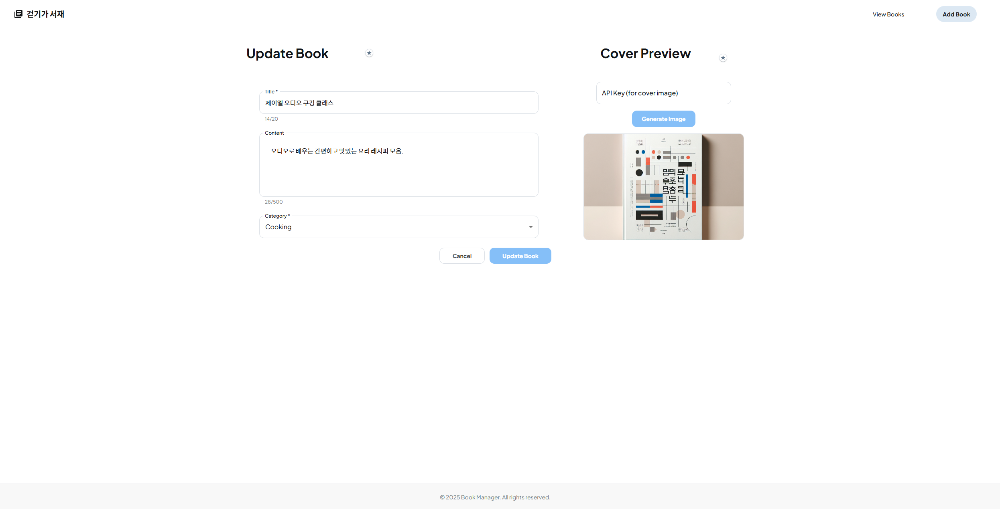
 
### API 연동 (`api.js`)
프론트엔드와 백엔드 서버 간의 모든 HTTP 통신은 `src/api.js` 파일에 정의된 함수들을 통해 표준화된 방식으로 이루어집니다. `axios` 라이브러리를 사용하여 RESTful API를 호출하며, 각 함수는 특정 API 엔드포인트와 매핑됩니다.

* **`createBook(bookData)`**: `POST /api/books` - 새 도서 정보 생성.
* **`getAllBooks(params)`**: `GET /api/books` - 모든 도서 목록 조회. 검색어, 페이지네이션, 정렬을 위한 파라미터를 받을 수 있습니다. (응답: `Page<BookResponse>`)
* **`getBookById(id)`**: `GET /api/books/{id}` - 특정 ID를 가진 도서의 상세 정보 조회. (응답: `BookResponse`)
* **`updateBook(id, bookData)`**: `PUT /api/books/{id}` - 특정 ID를 가진 도서의 전체 정보를 업데이트. (현재 프론트엔드에서는 주로 `partialUpdateBook` 사용)
* **`partialUpdateBook(id, bookData)`**: `PATCH /api/books/{id}` - 특정 ID를 가진 도서의 부분 정보를 업데이트. (응답: `BookResponse`)
* **`deleteBook(id)`**: `DELETE /api/books/{id}` - 특정 ID를 가진 도서 삭제. (응답: `void` 또는 `204 No Content`)
* **`generateBookCoverImage(title, apiKey)`**: `POST https://api.openai.com/v1/images/generations` - DALL-E API를 직접 호출하여 주어진 제목에 대한 책 표지 이미지를 생성. (프론트엔드에서 OpenAI API 키 필요)

 
### 스타일링 (`styles.jsx`)
애플리케이션의 전반적인 UI 디자인과 컴포넌트 스타일링은 **Material-UI (MUI)**의 `styled` API를 사용하여 `src/pages/styles.jsx` 파일에 중앙화되어 관리됩니다. 이를 통해 일관된 디자인 시스템을 유지하고 코드 재사용성을 높입니다.

* **`PageContainer`**: 모든 페이지의 최상위 레이아웃을 정의하는 컨테이너. flexbox를 사용하여 AppBar, 주 콘텐츠, Footer 영역을 배치합니다.
* **`MainContentContainer`**: 각 페이지의 주된 콘텐츠가 표시되는 영역. 반응형 디자인을 고려하여 최대 너비 및 패딩이 설정되어 있습니다.
* **`SectionTitle`**: 페이지 제목이나 섹션 제목에 사용되는 공통 타이포그래피 스타일.
* **`StyledTextField`**: 애플리케이션 전체에서 사용되는 텍스트 입력 필드의 공통 스타일 (테두리, 색상, 폰트 등).
* **`FormContainer`, `InputFieldWrapper`, `ButtonContainer`**: 폼 요소들의 레이아웃과 간격을 조정하는 컨테이너.
* **`ImagePreviewContainer`, `GeneratedCoverImage`, `CoverImage`, `NoImagePlaceholder`**: 책 표지 이미지 미리보기 및 관련 UI 요소들의 스타일.
* **`PrimaryButton`, `SecondaryButton`, `CancelButton`, `UpdateButton`, `GenerateButton`**: 다양한 용도의 버튼에 대한 공통 및 개별 스타일.
* 각 페이지(`AddBookPage`, `UpdateBookPage`, `BookDetailPage`, `ViewBooksPage`, `HomePage`) 및 기능(테이블, 로딩 스피너, 에러 메시지, Snackbar 알림 등)에 특화된 다수의 스타일 컴포넌트들이 정의되어 있습니다.


## Skills
- 백엔드 : Java, Spring Boot, Spring MVC (REST API), Spring Data JPA, Lombok
- 프론트엔드 : JavaScript (ES6+), React, Axios, React Router, Material-UI (MUI)
- 데이터베이스 : H2 (개발용)
- API : RESTful API, OpenAI API (DALL·E)
